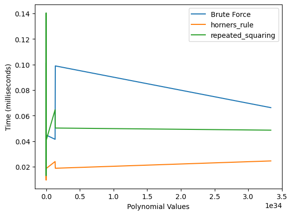
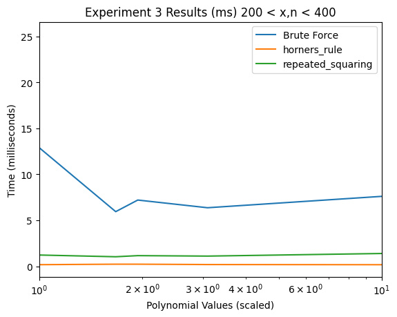

# Efficient Polynomial Evaluations

## Purpose:
The objective of this report is to evaluate the efficiency of three algorithms for evaluating polynomials of the form:

$$
P_n(x) = 1 + x + 2x^{2} + \dots + nx^{n}
$$

The algorithms to be tested are:
- **Brute Force Algorithm (B.F.)**
- **Horner's Algorithm (H.A.)**
- **Repeated Squaring Algorithm (R.S.)**

The evaluation will focus on the efficiency of these algorithms, with performance measured in milliseconds.

## Methodology:

### Measuring Runtime
To measure the efficiency of each algorithm, execution times were recorded using the `time.time()` method * 1000 to obtain the time in milliseconds. These times were then used to compare the performance of the three algorithms.

### Simulating Overflow

The range for a signed integer \( x \) is \( -2^{31} - 2 < x < 2^{31} \). To simulate overflow, the function begins with a starting value and computes:

$$
(\text{starting value} \mod (2^{31} - 1)) + (-2^{31} - 1)
$$

This process continues until the resulting value flows into the negative range, thus simulating the behavior you would expect when exceeding the maximum value for an signed integer. 


### Setup


```python
import IPython.core.display
from IPython.core.display import HTML
display(HTML("<style>div.output_area pre {white-space: pre; overflow-x: auto;}</style>"))

```


<style>div.output_area pre {white-space: pre; overflow-x: auto;}</style>


```python

from polynomials import *
from testing_tools import *
from decimal import Decimal
import random
random.seed(349)
```

## Experiment 1 - Observing Overflow
### Purpoe
The purpose of this round of testing is to witness the issue of *integer overflow* in each algorithm, B.F., H.A. and R.S. 


### Setup


```python
# Generate ten test cases, with x and n being between 20 and 40
ex1_test_cases = create_test_cases(10,20,40)
# Calculate values,get times for each algorithm
ex1_brute_force = generate_results(brute_force,ex1_test_cases)
ex1_horners_rule = generate_results(horners_rule,ex1_test_cases)
ex1_repeated_squaring = generate_results(repeated_squaring,ex1_test_cases)
# gets overflow values, appends them to seperate lists
of_bf = []
of_hr = []
of_rs = []

for i in ex1_brute_force.index:
    of_bf.append(trigger_overflow(i))
for i in ex1_horners_rule.index:
    of_hr.append(trigger_overflow(i))
for i in ex1_repeated_squaring.index:
    of_rs.append(trigger_overflow(i))
# add lists to dataframes
ex1_brute_force['overflow_value']= of_bf
ex1_horners_rule['overflow_value']= of_hr
ex1_repeated_squaring['overflow_value']=of_rs
```

### Results


```python
ex1_brute_force
```


<div>
<style scoped>
    .dataframe tbody tr th:only-of-type {
        vertical-align: middle;
    }

    .dataframe tbody tr th {
        vertical-align: top;
    }

    .dataframe thead th {
        text-align: right;
    }
</style>
<table border="1" class="dataframe">
  <thead>
    <tr style="text-align: right;">
      <th></th>
      <th>x</th>
      <th>n</th>
      <th>time_ms</th>
      <th>overflow_value</th>
    </tr>
    <tr>
      <th>value</th>
      <th></th>
      <th></th>
      <th></th>
      <th></th>
    </tr>
  </thead>
  <tbody>
    <tr>
      <th>26128640051322339214200517265441</th>
      <td>32</td>
      <td>20</td>
      <td>0.042439</td>
      <td>-1101672116</td>
    </tr>
    <tr>
      <th>1996741937554908233595081063731197333</th>
      <td>33</td>
      <td>23</td>
      <td>0.065088</td>
      <td>-1181803871</td>
    </tr>
    <tr>
      <th>2309109693578016554561650587452782526</th>
      <td>25</td>
      <td>25</td>
      <td>0.079155</td>
      <td>-2140227056</td>
    </tr>
    <tr>
      <th>80101755682854128724854833138522610863767</th>
      <td>38</td>
      <td>25</td>
      <td>0.048876</td>
      <td>-1899782934</td>
    </tr>
    <tr>
      <th>2780360792608500523066841317478021263919035</th>
      <td>33</td>
      <td>27</td>
      <td>0.076771</td>
      <td>-489754519</td>
    </tr>
    <tr>
      <th>3258809607248249672869186600707141409626811</th>
      <td>26</td>
      <td>29</td>
      <td>0.089169</td>
      <td>-1356372749</td>
    </tr>
    <tr>
      <th>40238805592353902734050921420158437930666017</th>
      <td>32</td>
      <td>28</td>
      <td>0.073671</td>
      <td>-2074083328</td>
    </tr>
    <tr>
      <th>6382380277892389334126040428061831153388822831</th>
      <td>30</td>
      <td>30</td>
      <td>0.058651</td>
      <td>-1273913505</td>
    </tr>
    <tr>
      <th>197861133125915959334126040428061831153388822831</th>
      <td>30</td>
      <td>31</td>
      <td>0.097513</td>
      <td>-210390963</td>
    </tr>
    <tr>
      <th>7617625065049918706049043088302134453506857373335</th>
      <td>38</td>
      <td>30</td>
      <td>0.081301</td>
      <td>-1051499973</td>
    </tr>
    <tr>
      <th>2868357590936484081550370128563960366373233114374210821</th>
      <td>36</td>
      <td>34</td>
      <td>0.074863</td>
      <td>-1781578221</td>
    </tr>
  </tbody>
</table>
</div>


```python
ex1_horners_rule
```


<div>
<style scoped>
    .dataframe tbody tr th:only-of-type {
        vertical-align: middle;
    }

    .dataframe tbody tr th {
        vertical-align: top;
    }

    .dataframe thead th {
        text-align: right;
    }
</style>
<table border="1" class="dataframe">
  <thead>
    <tr style="text-align: right;">
      <th></th>
      <th>x</th>
      <th>n</th>
      <th>time_ms</th>
      <th>overflow_value</th>
    </tr>
    <tr>
      <th>value</th>
      <th></th>
      <th></th>
      <th></th>
      <th></th>
    </tr>
  </thead>
  <tbody>
    <tr>
      <th>26128640051322339214200517265441</th>
      <td>32</td>
      <td>20</td>
      <td>0.01502</td>
      <td>-1101672116</td>
    </tr>
    <tr>
      <th>1996741937554908233595081063731197333</th>
      <td>33</td>
      <td>23</td>
      <td>0.016212</td>
      <td>-1181803871</td>
    </tr>
    <tr>
      <th>2309109693578016554561650587452782526</th>
      <td>25</td>
      <td>25</td>
      <td>0.018835</td>
      <td>-2140227056</td>
    </tr>
    <tr>
      <th>80101755682854128724854833138522610863767</th>
      <td>38</td>
      <td>25</td>
      <td>0.016928</td>
      <td>-1899782934</td>
    </tr>
    <tr>
      <th>2780360792608500523066841317478021263919035</th>
      <td>33</td>
      <td>27</td>
      <td>0.025511</td>
      <td>-489754519</td>
    </tr>
    <tr>
      <th>3258809607248249672869186600707141409626811</th>
      <td>26</td>
      <td>29</td>
      <td>0.030518</td>
      <td>-1356372749</td>
    </tr>
    <tr>
      <th>40238805592353902734050921420158437930666017</th>
      <td>32</td>
      <td>28</td>
      <td>0.026941</td>
      <td>-2074083328</td>
    </tr>
    <tr>
      <th>6382380277892389334126040428061831153388822831</th>
      <td>30</td>
      <td>30</td>
      <td>0.017166</td>
      <td>-1273913505</td>
    </tr>
    <tr>
      <th>197861133125915959334126040428061831153388822831</th>
      <td>30</td>
      <td>31</td>
      <td>0.020504</td>
      <td>-210390963</td>
    </tr>
    <tr>
      <th>7617625065049918706049043088302134453506857373335</th>
      <td>38</td>
      <td>30</td>
      <td>0.017405</td>
      <td>-1051499973</td>
    </tr>
    <tr>
      <th>2868357590936484081550370128563960366373233114374210821</th>
      <td>36</td>
      <td>34</td>
      <td>0.020742</td>
      <td>-1781578221</td>
    </tr>
  </tbody>
</table>
</div>


```python
ex1_repeated_squaring
```


<div>
<style scoped>
    .dataframe tbody tr th:only-of-type {
        vertical-align: middle;
    }

    .dataframe tbody tr th {
        vertical-align: top;
    }

    .dataframe thead th {
        text-align: right;
    }
</style>
<table border="1" class="dataframe">
  <thead>
    <tr style="text-align: right;">
      <th></th>
      <th>x</th>
      <th>n</th>
      <th>time_ms</th>
      <th>overflow_value</th>
    </tr>
    <tr>
      <th>value</th>
      <th></th>
      <th></th>
      <th></th>
      <th></th>
    </tr>
  </thead>
  <tbody>
    <tr>
      <th>26128640051322339214200517265441</th>
      <td>32</td>
      <td>20</td>
      <td>0.03767</td>
      <td>-1101672116</td>
    </tr>
    <tr>
      <th>1996741937554908233595081063731197333</th>
      <td>33</td>
      <td>23</td>
      <td>0.048876</td>
      <td>-1181803871</td>
    </tr>
    <tr>
      <th>2309109693578016554561650587452782526</th>
      <td>25</td>
      <td>25</td>
      <td>0.06485</td>
      <td>-2140227056</td>
    </tr>
    <tr>
      <th>80101755682854128724854833138522610863767</th>
      <td>38</td>
      <td>25</td>
      <td>0.045776</td>
      <td>-1899782934</td>
    </tr>
    <tr>
      <th>2780360792608500523066841317478021263919035</th>
      <td>33</td>
      <td>27</td>
      <td>0.050783</td>
      <td>-489754519</td>
    </tr>
    <tr>
      <th>3258809607248249672869186600707141409626811</th>
      <td>26</td>
      <td>29</td>
      <td>0.051975</td>
      <td>-1356372749</td>
    </tr>
    <tr>
      <th>40238805592353902734050921420158437930666017</th>
      <td>32</td>
      <td>28</td>
      <td>0.053167</td>
      <td>-2074083328</td>
    </tr>
    <tr>
      <th>6382380277892389334126040428061831153388822831</th>
      <td>30</td>
      <td>30</td>
      <td>0.053406</td>
      <td>-1273913505</td>
    </tr>
    <tr>
      <th>197861133125915959334126040428061831153388822831</th>
      <td>30</td>
      <td>31</td>
      <td>0.058889</td>
      <td>-210390963</td>
    </tr>
    <tr>
      <th>7617625065049918706049043088302134453506857373335</th>
      <td>38</td>
      <td>30</td>
      <td>0.060797</td>
      <td>-1051499973</td>
    </tr>
    <tr>
      <th>2868357590936484081550370128563960366373233114374210821</th>
      <td>36</td>
      <td>34</td>
      <td>0.100374</td>
      <td>-1781578221</td>
    </tr>
  </tbody>
</table>
</div>


### Findings
In round one, 
* *Brute Force Algorithm*, 
* *Horner's Algorithm* ,
* *Repeated Squaring Algorithm*,\
\
were each tested within a large range:
$$\begin{aligned}
x,n \in [20,40] \\
s.t.\\
value > 2^{31}-1\text{ or }2147483647 \\
\end{aligned}$$

Integer Overflow was successfully triggered in each case. 

## Experiment 2 - Small Value Tests

### Purpose:
The purpose of this round is to test each algorithm on small values to evaluate their accuracy. Based on the results from the previous round—where the value lengths matched and the first and last digits were consistent, it is highly likely that the algorithms are functioning correctly.

### Preliminary Observations:
Given the positive outcome from the previous tests, it is reasonable to assume that the algorithms are working as intended. However, this round will serve to further confirm their accuracy with small input values.

### Setup


```python
# Generate thirty test cases, with x and n being between 2 and 25
ex2_test_cases = create_test_cases(100,2,25)
# Calculate values,get times for each algorithm
ex2_brute_force = generate_results(brute_force,ex2_test_cases)
ex2_horners_rule = generate_results(horners_rule,ex2_test_cases)
ex2_repeated_squaring = generate_results(repeated_squaring,ex2_test_cases)
```

### Results


```python
ex2_brute_force.head(10)
```


<div>
<style scoped>
    .dataframe tbody tr th:only-of-type {
        vertical-align: middle;
    }

    .dataframe tbody tr th {
        vertical-align: top;
    }

    .dataframe thead th {
        text-align: right;
    }
</style>
<table border="1" class="dataframe">
  <thead>
    <tr style="text-align: right;">
      <th></th>
      <th>x</th>
      <th>n</th>
      <th>time_ms</th>
    </tr>
    <tr>
      <th>value</th>
      <th></th>
      <th></th>
      <th></th>
    </tr>
  </thead>
  <tbody>
    <tr>
      <th>35</th>
      <td>2</td>
      <td>3</td>
      <td>0.015736</td>
    </tr>
    <tr>
      <th>211</th>
      <td>10</td>
      <td>2</td>
      <td>0.01955</td>
    </tr>
    <tr>
      <th>229</th>
      <td>4</td>
      <td>3</td>
      <td>0.022173</td>
    </tr>
    <tr>
      <th>352</th>
      <td>13</td>
      <td>2</td>
      <td>0.020504</td>
    </tr>
    <tr>
      <th>427</th>
      <td>3</td>
      <td>4</td>
      <td>0.01359</td>
    </tr>
    <tr>
      <th>431</th>
      <td>5</td>
      <td>3</td>
      <td>0.017166</td>
    </tr>
    <tr>
      <th>466</th>
      <td>15</td>
      <td>2</td>
      <td>0.013351</td>
    </tr>
    <tr>
      <th>529</th>
      <td>16</td>
      <td>2</td>
      <td>0.011683</td>
    </tr>
    <tr>
      <th>821</th>
      <td>20</td>
      <td>2</td>
      <td>0.012875</td>
    </tr>
    <tr>
      <th>1135</th>
      <td>7</td>
      <td>3</td>
      <td>0.01359</td>
    </tr>
  </tbody>
</table>
</div>


```python
ex2_horners_rule.head(10)
```


<div>
<style scoped>
    .dataframe tbody tr th:only-of-type {
        vertical-align: middle;
    }

    .dataframe tbody tr th {
        vertical-align: top;
    }

    .dataframe thead th {
        text-align: right;
    }
</style>
<table border="1" class="dataframe">
  <thead>
    <tr style="text-align: right;">
      <th></th>
      <th>x</th>
      <th>n</th>
      <th>time_ms</th>
    </tr>
    <tr>
      <th>value</th>
      <th></th>
      <th></th>
      <th></th>
    </tr>
  </thead>
  <tbody>
    <tr>
      <th>35</th>
      <td>2</td>
      <td>3</td>
      <td>0.012398</td>
    </tr>
    <tr>
      <th>211</th>
      <td>10</td>
      <td>2</td>
      <td>0.012875</td>
    </tr>
    <tr>
      <th>229</th>
      <td>4</td>
      <td>3</td>
      <td>0.013351</td>
    </tr>
    <tr>
      <th>352</th>
      <td>13</td>
      <td>2</td>
      <td>0.02718</td>
    </tr>
    <tr>
      <th>427</th>
      <td>3</td>
      <td>4</td>
      <td>0.011444</td>
    </tr>
    <tr>
      <th>431</th>
      <td>5</td>
      <td>3</td>
      <td>0.012159</td>
    </tr>
    <tr>
      <th>466</th>
      <td>15</td>
      <td>2</td>
      <td>0.011683</td>
    </tr>
    <tr>
      <th>529</th>
      <td>16</td>
      <td>2</td>
      <td>0.011683</td>
    </tr>
    <tr>
      <th>821</th>
      <td>20</td>
      <td>2</td>
      <td>0.017166</td>
    </tr>
    <tr>
      <th>1135</th>
      <td>7</td>
      <td>3</td>
      <td>0.016212</td>
    </tr>
  </tbody>
</table>
</div>


```python
ex2_repeated_squaring.head(10)
```


<div>
<style scoped>
    .dataframe tbody tr th:only-of-type {
        vertical-align: middle;
    }

    .dataframe tbody tr th {
        vertical-align: top;
    }

    .dataframe thead th {
        text-align: right;
    }
</style>
<table border="1" class="dataframe">
  <thead>
    <tr style="text-align: right;">
      <th></th>
      <th>x</th>
      <th>n</th>
      <th>time_ms</th>
    </tr>
    <tr>
      <th>value</th>
      <th></th>
      <th></th>
      <th></th>
    </tr>
  </thead>
  <tbody>
    <tr>
      <th>35</th>
      <td>2</td>
      <td>3</td>
      <td>0.025988</td>
    </tr>
    <tr>
      <th>211</th>
      <td>10</td>
      <td>2</td>
      <td>0.016928</td>
    </tr>
    <tr>
      <th>229</th>
      <td>4</td>
      <td>3</td>
      <td>0.016451</td>
    </tr>
    <tr>
      <th>352</th>
      <td>13</td>
      <td>2</td>
      <td>0.013113</td>
    </tr>
    <tr>
      <th>427</th>
      <td>3</td>
      <td>4</td>
      <td>0.017166</td>
    </tr>
    <tr>
      <th>431</th>
      <td>5</td>
      <td>3</td>
      <td>0.020742</td>
    </tr>
    <tr>
      <th>466</th>
      <td>15</td>
      <td>2</td>
      <td>0.02408</td>
    </tr>
    <tr>
      <th>529</th>
      <td>16</td>
      <td>2</td>
      <td>0.023603</td>
    </tr>
    <tr>
      <th>821</th>
      <td>20</td>
      <td>2</td>
      <td>0.016928</td>
    </tr>
    <tr>
      <th>1135</th>
      <td>7</td>
      <td>3</td>
      <td>0.017166</td>
    </tr>
  </tbody>
</table>
</div>


```python
ex2_values = pd.DataFrame({
    "Brute_Force": ex2_brute_force.index.tolist(),
    "Horners_Algo": ex2_horners_rule.index.tolist(),
    "Repeated_Sq": ex2_repeated_squaring.index.tolist()
})
```


```python
ex2_values.head(10)
```


<div>
<style scoped>
    .dataframe tbody tr th:only-of-type {
        vertical-align: middle;
    }

    .dataframe tbody tr th {
        vertical-align: top;
    }

    .dataframe thead th {
        text-align: right;
    }
</style>
<table border="1" class="dataframe">
  <thead>
    <tr style="text-align: right;">
      <th></th>
      <th>Brute_Force</th>
      <th>Horners_Algo</th>
      <th>Repeated_Sq</th>
    </tr>
  </thead>
  <tbody>
    <tr>
      <th>0</th>
      <td>35</td>
      <td>35</td>
      <td>35</td>
    </tr>
    <tr>
      <th>1</th>
      <td>211</td>
      <td>211</td>
      <td>211</td>
    </tr>
    <tr>
      <th>2</th>
      <td>229</td>
      <td>229</td>
      <td>229</td>
    </tr>
    <tr>
      <th>3</th>
      <td>352</td>
      <td>352</td>
      <td>352</td>
    </tr>
    <tr>
      <th>4</th>
      <td>427</td>
      <td>427</td>
      <td>427</td>
    </tr>
    <tr>
      <th>5</th>
      <td>431</td>
      <td>431</td>
      <td>431</td>
    </tr>
    <tr>
      <th>6</th>
      <td>466</td>
      <td>466</td>
      <td>466</td>
    </tr>
    <tr>
      <th>7</th>
      <td>529</td>
      <td>529</td>
      <td>529</td>
    </tr>
    <tr>
      <th>8</th>
      <td>821</td>
      <td>821</td>
      <td>821</td>
    </tr>
    <tr>
      <th>9</th>
      <td>1135</td>
      <td>1135</td>
      <td>1135</td>
    </tr>
  </tbody>
</table>
</div>


### Visualization


```python
plt.plot(ex2_brute_force.index,ex2_brute_force['time_ms'],label='Brute Force')
plt.plot(ex2_horners_rule.index,ex2_horners_rule['time_ms'],label='horners_rule')
plt.plot(ex2_repeated_squaring.index,ex2_repeated_squaring['time_ms'],label='repeated_squaring')
plt.xlabel("Polynomial Values")
plt.ylabel("Time (milliseconds)")
plt.legend()
plt.show()
```


    

    


### Findings
The functions are working as expected, each outputting the same values. It is interesting to witness that even at small values for x and n, 2 < x,n < 25, we are witnessing that the most efficient algorithm is **H.R.** while the least efficient is **B.F.**. 

#### Number of Multiplications

**Brute Force: $5n^2 +6n$**\
\
**Repeated Squaring: $~n*log_{2}n$** because the number of multiplications to get each term is:$2^k = log_{2}k$, and this is done n times.\
\
**Horners Rule: $n$**
#### Conclusion
The times recorded in the visualization follow what I would expect. 
Using L'hopital's Rule, we can show that the growth factor for Horner's Rule is slower than both other techniques.
\
\
**Comparing to Repeated Squaring** \
\
$\lim_{n \to \infty} \frac{n \log n}{n} = \lim_{n \to \infty} \frac{n\ln{n}}{ln{2}} = \infty$\
\
**Comparing to Brute Force**\
\
$\lim_{n \to \infty} \frac{5n^2 + 6n}{n} = \lim_{n \to \infty} \frac{10n+6}{1} = \infty$

## Experiment 3 - Large Numbers
### Purpose
The purpose of this experiment is to test if the findings from experiment two will hold true at large values for $x$ and $n$.Given what we know about algorithms, namely that they can behave unexpectedly at small values, due to overhead cost, I would expect the trend lines to become even smoother with larger values for x and n.
## Setup


```python
# Generate thirty test cases, with x and n being between 3 and 35
ex3_test_cases = create_test_cases(1000,200,400)
# Calculate values,get times for each algorithm
ex3_brute_force = generate_results(brute_force,ex3_test_cases)
ex3_horners_rule = generate_results(horners_rule,ex3_test_cases)
ex3_repeated_squaring = generate_results(repeated_squaring,ex3_test_cases)
```


```python
ex3_values = pd.DataFrame({
    "Brute_Force": ex3_brute_force.index.tolist(),
    "Horners_Algo": ex3_horners_rule.index.tolist(),
    "Repeated_Sq": ex3_repeated_squaring.index.tolist()
},dtype=object)
print("Experiment 3 polynomial values, for 200< x,n 400")
ex3_values.head(10)
```

    Experiment 3 polynomial values, for 200< x,n 400


<div>
<style scoped>
    .dataframe tbody tr th:only-of-type {
        vertical-align: middle;
    }

    .dataframe tbody tr th {
        vertical-align: top;
    }

    .dataframe thead th {
        text-align: right;
    }
</style>
<table border="1" class="dataframe">
  <thead>
    <tr style="text-align: right;">
      <th></th>
      <th>Brute_Force</th>
      <th>Horners_Algo</th>
      <th>Repeated_Sq</th>
    </tr>
  </thead>
  <tbody>
    <tr>
      <th>0</th>
      <td>2469506484926056870385553684107728152670710916...</td>
      <td>2469506484926056870385553684107728152670710916...</td>
      <td>2469506484926056870385553684107728152670710916...</td>
    </tr>
    <tr>
      <th>1</th>
      <td>1862162492468231049859954279772787720682759597...</td>
      <td>1862162492468231049859954279772787720682759597...</td>
      <td>1862162492468231049859954279772787720682759597...</td>
    </tr>
    <tr>
      <th>2</th>
      <td>2129181343850792886734509598891867290306977454...</td>
      <td>2129181343850792886734509598891867290306977454...</td>
      <td>2129181343850792886734509598891867290306977454...</td>
    </tr>
    <tr>
      <th>3</th>
      <td>6626268684254562472383963361280647280431209299...</td>
      <td>6626268684254562472383963361280647280431209299...</td>
      <td>6626268684254562472383963361280647280431209299...</td>
    </tr>
    <tr>
      <th>4</th>
      <td>7776132835259963575912691227037750828903942901...</td>
      <td>7776132835259963575912691227037750828903942901...</td>
      <td>7776132835259963575912691227037750828903942901...</td>
    </tr>
    <tr>
      <th>5</th>
      <td>4326283160981517923639094506672022461218408907...</td>
      <td>4326283160981517923639094506672022461218408907...</td>
      <td>4326283160981517923639094506672022461218408907...</td>
    </tr>
    <tr>
      <th>6</th>
      <td>2416782434316942958923246197096913029625138405...</td>
      <td>2416782434316942958923246197096913029625138405...</td>
      <td>2416782434316942958923246197096913029625138405...</td>
    </tr>
    <tr>
      <th>7</th>
      <td>2291086700892424969399618320884876628711728691...</td>
      <td>2291086700892424969399618320884876628711728691...</td>
      <td>2291086700892424969399618320884876628711728691...</td>
    </tr>
    <tr>
      <th>8</th>
      <td>7146356407524127753110536461872184749169905056...</td>
      <td>7146356407524127753110536461872184749169905056...</td>
      <td>7146356407524127753110536461872184749169905056...</td>
    </tr>
    <tr>
      <th>9</th>
      <td>1097577337639873755599946178361510283112945632...</td>
      <td>1097577337639873755599946178361510283112945632...</td>
      <td>1097577337639873755599946178361510283112945632...</td>
    </tr>
  </tbody>
</table>
</div>


### Results


```python
ex3_times = pd.DataFrame({
    "Brute_Force": ex3_brute_force['time_ms'].tolist(),
    "Horners_Algo": ex3_horners_rule['time_ms'].tolist(),
    "Repeated_Sq": ex3_repeated_squaring['time_ms'].tolist()
},dtype=object)
print("Experiment 3 times (milliseconds)")
ex3_times.head(10)
```

    Experiment 3 times (milliseconds)


<div>
<style scoped>
    .dataframe tbody tr th:only-of-type {
        vertical-align: middle;
    }

    .dataframe tbody tr th {
        vertical-align: top;
    }

    .dataframe thead th {
        text-align: right;
    }
</style>
<table border="1" class="dataframe">
  <thead>
    <tr style="text-align: right;">
      <th></th>
      <th>Brute_Force</th>
      <th>Horners_Algo</th>
      <th>Repeated_Sq</th>
    </tr>
  </thead>
  <tbody>
    <tr>
      <th>0</th>
      <td>3.909349</td>
      <td>0.091791</td>
      <td>0.597715</td>
    </tr>
    <tr>
      <th>1</th>
      <td>2.471924</td>
      <td>0.101089</td>
      <td>0.645876</td>
    </tr>
    <tr>
      <th>2</th>
      <td>3.033876</td>
      <td>0.121593</td>
      <td>0.821114</td>
    </tr>
    <tr>
      <th>3</th>
      <td>2.660751</td>
      <td>0.092268</td>
      <td>0.566244</td>
    </tr>
    <tr>
      <th>4</th>
      <td>2.606392</td>
      <td>0.104666</td>
      <td>0.567436</td>
    </tr>
    <tr>
      <th>5</th>
      <td>2.635002</td>
      <td>0.106335</td>
      <td>0.661612</td>
    </tr>
    <tr>
      <th>6</th>
      <td>2.938509</td>
      <td>0.104189</td>
      <td>0.610352</td>
    </tr>
    <tr>
      <th>7</th>
      <td>3.619432</td>
      <td>0.097036</td>
      <td>0.785351</td>
    </tr>
    <tr>
      <th>8</th>
      <td>2.683401</td>
      <td>0.111103</td>
      <td>0.715971</td>
    </tr>
    <tr>
      <th>9</th>
      <td>2.57349</td>
      <td>0.110865</td>
      <td>0.635386</td>
    </tr>
  </tbody>
</table>
</div>


```python
factor = Decimal('2708126981146283263065532936805189036244631752332186224195474016409515081474151160464515388175936602237667073475586011983118436587835682216057311337991241848794281607538103588203391699022104751882963533050247362982137228576751651439671365072548000739325036036360366503828296908779901503133469219296157250103231937549427749201823359119625587673489932018680581019286552071244575101384679713597811307262329291925520226044984822225169764978836615338164288006671033366747055921708939717200561326644055774349203442526399012310152924065529646137149513439943087206575200715333935742753011047927155693768187187282112545921001525643638858096248166520787666666303331672892411784988524064221640159562195865901773837773105289757840861')

# divide each value by the smallest value, to limit overflow when graphing
xbf = ex3_brute_force.index / factor
xhr = ex3_horners_rule.index / factor
xrs = ex3_repeated_squaring.index / factor
```

### Visualization


```python
plt.plot(xbf,ex3_brute_force['time_ms'],label='Brute Force')
plt.plot(xhr,ex3_horners_rule['time_ms'],label='horners_rule')
plt.plot(xrs,ex3_repeated_squaring['time_ms'],label='repeated_squaring')
plt.title("Experiment 3 Results (ms) 200 < x,n < 400")
plt.xlabel("Polynomial Values (scaled)")
plt.ylabel("Time (milliseconds)")
plt.legend()
plt.xscale('log')
plt.show()
```

    /home/lauren/Projects/3130_P1LaurenFyle/environment/lib/python3.11/site-packages/matplotlib/scale.py:270: RuntimeWarning: overflow encountered in power
      return np.power(self.base, values)


    

    


```python
bf_val = number_to_digits(ex3_values['Brute_Force'].iloc[567])
ha_val = number_to_digits(ex3_values['Horners_Algo'].iloc[567])
rs_val = number_to_digits(ex3_values['Repeated_Sq'].iloc[567])
```

### Comparing Random Slices


```python
compare_digits(bf_val,ha_val, rs_val)
```

    indices a-b: 646-662
    
    index0: 7 7 7
    
    index1: 0 0 0
    
    index2: 4 4 4
    
    index3: 3 3 3
    
    index4: 1 1 1
    
    index5: 3 3 3
    
    index6: 6 6 6
    
    index7: 5 5 5
    
    index8: 8 8 8
    
    index9: 7 7 7
    
    index10: 1 1 1
    
    index11: 6 6 6
    
    index12: 3 3 3
    
    index13: 1 1 1
    
    index14: 7 7 7
    
    index15: 9 9 9
    


## Final Results
The pattern established in experiment two held in experiment three. The random digit check held consistantly for randomly generated *a* and *b*.
One thing that surprised me at larger values of x and n was how the gap between Horner's Algorithm and the Repeated Squaring algorithm got smaller, showing how the efficiency of algorithms can change given larger values. 
